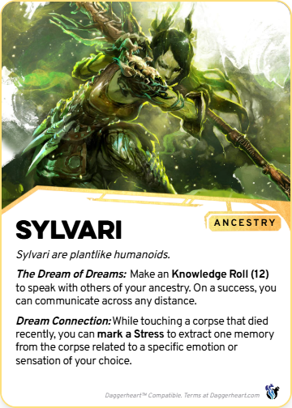

# Javan's Character: Exile Oracle from a Broken Dream

  
  <!--   -->
  <!-- <strong>SYLVARI ANCESTRY</strong> -->

**Player:** Javan (he/him)  
**Character Concept:** Exile Sylvari Seer - an oracle cut off from the Dream of Dreams, trying to regrow a living beacon  
**Ancestry:** Sylvari (custom - plant-like humanoid, not Fungril)  
**Class:** Witch (Divination, Hexes)

**Core Theme:** *"The Dream can be replanted wherever hope takes root."*

## Character Essence

An exiled Sylvari mystic whose visions once flowed through the Dream of Dreams. Cut off from the network, he now reads omens in seeds, ash, and starlight, determined to grow a new Grove that can call the Dream back to this barren world.

**Energy:** Blue - Calm, thoughtful, emotionally sensitive, melancholic. A gentle presence who sees beauty in decay and potential in death. Speaks softly but with weight. Moves deliberately, like seasons changing.

---

## Backstory

### Why Were You Imprisoned?

**Crime:** Eco-terrorism / Unauthorized Bioterrorism

**Option 1:** Released aggressive spore colonies into a corporate facility exploiting indigenous plant life. Collateral damage resulted in casualties.

**Option 2:** Contaminated a water treatment plant with symbiotic algae to purify industrial runoff, but the algae evolved beyond control and affected neighboring settlements.

**Option 3:** Sabotaged genetic modification labs experimenting on sapient plant species by introducing "liberation seeds" that allowed test subjects to escape—some were dangerous.

You don't deny your actions. The court called it terrorism. You called it protection of the voiceless.

### Jail Experience

**Pre-Prison Planet (2 years):** Placed in bio-containment with other dangerous biological species. The containment shielding blocked your connection to the Dream. At first, the silence was deafening, but slowly you adapted—learning to hear your own thoughts without the chorus of your people.

**Cellmate - Bory:** Paired with a violent Ribbet enforcer for two years. You taught him about cycles (anger-release-peace-renewal) and that his roots could anchor him rather than confine him. You grew small plants from smuggled seeds in your cell, and watching them calmed him. By the end, Bory had killed only 4 prisoners (down from dozens). You considered this a successful harvest.

**On Prison Planet:** The Dream is completely severed here. The planet is remote, barren, inhospitable—too far from any known Sylvari presence to maintain connection. You can't sense if any of your kind are here, and the silence is profound. But there's peace in it too. For the first time, you are truly individual. And paradoxically, this isolation has made you desperate to connect—not just to Sylvari, but to anyone willing to stand within the circle of your future Grove.

---

## The Ritual: Network Expansion

**The Communion of Fallen Seeds** *(name to be workshopped)*

A binding ritual that births a living Grove that can act as a local node of the Dream of Dreams. The ritual requires four sacred elements:

1. **Oath** - A promise of guardianship. Each participant must swear to protect and tend the others, witnessed by someone of spiritual authority
2. **Seed** - Three seeds taken from the Sylvari's own body, representing life and potential
3. **Ash** - Ashes of the dead, representing rebirth and transformation. Memory made physical
4. **Tears** - Tears of the living, representing emotional investment and vulnerability

**The Ceremony:** Seeds are planted in soil mixed with ash and tears, while oaths are spoken. Each member of the chosen family must contribute one element, binding them together in a network of mutual care.

**What Grows:** If successful, a **Grove Marker** emerges—a young tree that acts as both a living node connecting all participants and a future beacon for the Dream. This seedling must be tended, nurtured, and protected. As the bonds between the family deepen through shared experiences, positive emotions, and acts of care, the Grove grows stronger and your visions sharpen. Eventually, if cultivated properly, it can grow powerful enough to reach across the stars and reconnect with the Mother Tree's Dream.

---

## Goals: The Path to the Grove

**Long‑term: (Thriving)**
- Use the Grove as a beacon to reconnect to the Mother Tree and reshape the Dream with these new stories.

**Mid‑term (Growing)**
- Perform the Dream of Dreams ceremony to create a new Grove
- Ensure the seedling for the Grove takes root during its early phase
- Tend the Grove - Protect it, and help it THRIVE through deepening bonds

**Short-Term goals (Gathering)**
- Confirm whether any other Sylvari are on the Prison Planet
- Identify and gather the four ritual elements

---

## Relationships with Other PCs

**Bory:** Former cellmate for two years. You helped shape his "healthy Bory" persona, teaching him about cycles of growth and the difference between strength and violence. He was your first student in patience, and you see his ongoing struggle to change as the most beautiful thing—like a bulb pushing through frozen earth. You believe in him completely.

**Tess:** You've invited them to bless the Communion ritual so it's recognized by local faith. Their spiritual authority would legitimize the oaths, and you respect their desire to build sacred community. You see your Grove and their church as sister projects—both creating sanctuary in a hostile place.

**Sarah:** You've asked her to help archive memories inside the new network as part of her own "uncorrupt my memories" quest. You believe that by helping others preserve what's precious, she might find a way to heal what's been damaged in herself. Memory is sacred, and you can tend it together.

---

## Character Mechanics & Flavor

### Ancestry Abilities (Sylvari)
- **Dream of Dreams Communication:** Sylvari can communicate across any distance through their shared network. *Currently severed—Prison Planet is too remote.*
- **Alternative divination methods:** Seed readings, leaf readings, bark carvings, dream interpretation, star patterns

### Divination System - Domain Cards
- Cards are grown from Mother Tree materials. Distance from the Mother Tree makes readings more cryptic.
- **Prison Challenge:** All belongings stripped on arrival. Must grow new cards from Prison Planet materials.
- **Progression:** As you gain witch abilities, you literally grow Domain cards from local natural materials.

---

## Reflavored Tarot: "The Sylvan Deck"

Traditional Tarot reimagined using plant biology and natural phenomena.

### The Minor Arcana (The Suits)

1. **Branches** (Wands) - Action, Will, Growth, Ambition, Creativity
2. **Blossoms** (Cups) - Emotion, Intuition, Relationships, Healing
3. **Thorns** (Swords) - Intellect, Conflict, Truth, Protection, Pain
4. **Roots** (Pentacles) - Material World, Stability, Health, Resources, Heritage

### The Major Arcana (The Archetypes)

| Traditional Card | Sylvan Reflavor | Concept |
| :--- | :--- | :--- |
| **0. The Fool** | **The Seedling** | Potential, new beginnings, naivety |
| **I. The Magician** | **The Shaper** | Manifestation, using the elements |
| **II. The High Priestess** | **The Dreamer** | Intuition, the Dream of Dreams, subconscious |
| **III. The Empress** | **The Mother Tree** | Fertility, creation, nature, nurturing |
| **IV. The Emperor** | **The Mountain** | Structure, authority, immovability, stability |
| **V. The Hierophant** | **The Grove Keeper** | Tradition, spiritual guidance, shared knowledge |
| **VI. The Lovers** | **Life** | Connection, harmony, choices (grafting) |
| **VII. The Chariot** | **The River** | Movement, force of nature, overcoming obstacles |
| **VIII. Strength** | **The Bear** | Endurance, inner strength, patience |
| **IX. The Hermit** | **The Moss** | Solitude, introspection, slow growth in quiet places |
| **X. Wheel of Fortune** | **The Seasons** | Cycles, change, inevitability |
| **XI. Justice** | **The Balance** | Cause and effect, equilibrium in the ecosystem |
| **XII. The Hanged Man** | **Winter** | Suspension, sacrifice for spring, waiting |
| **XIII. Death** | **Death** | Transformation, ending to feed the new, fungi |
| **XIV. Temperance** | **Photosynthesis** | Alchemy, blending elements (sun + water), patience |
| **XV. The Devil** | **The Parasite** | Addiction, unhealthy attachment, strangling vines |
| **XVI. The Tower** | **Lightning** | Sudden destruction, clearing the brush, revelation |
| **XVII. The Star** | **The Star** | Hope, guidance, navigation |
| **XVIII. The Moon** | **The Moon** | Illusion, fear, cycles |
| **XIX. The Sun** | **The Sun** | Joy, success, vitality |
| **XX. Judgment** | **The Harvest** | Assessment, reaping what was sown, awakening |
| **XXI. The World** | **The World** | Completion, wholeness, the interconnected web |

---

## TL;DR – Exile Oracle from a Broken Dream

Sylvari seer, cut off from the Dream of Dreams. 
Preparing a ceremony with new-found allies to grow a Grove on this barren world. 
If the Grove thrives, it becomes a living beacon to reconnect to the Mother Tree and rewrite the Dream with the stories of exiles and outcasts.
